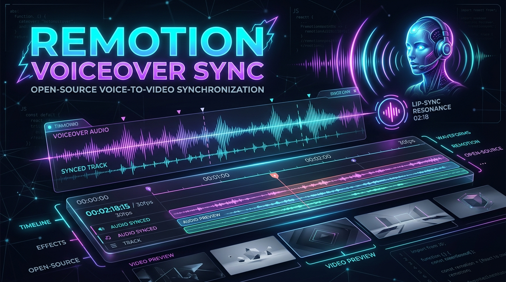
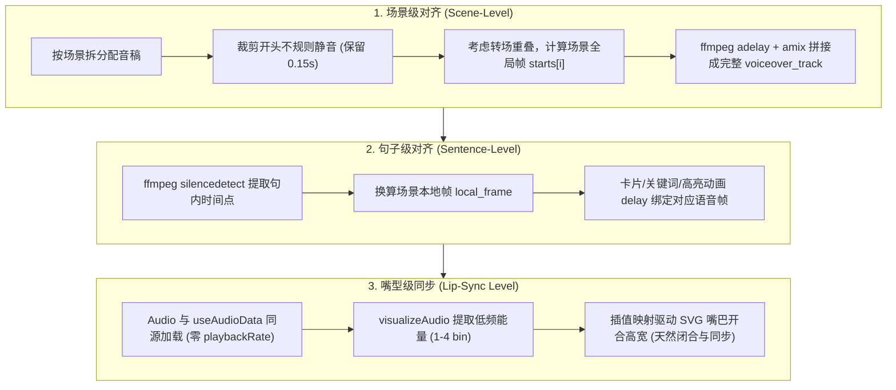

# remotion-voiceover-sync — Remotion 动画与 AI 配音逐帧对齐技能包

<p align="center">
  
</p>

<p align="center">
  <a href="https://www.remotion.dev/"></a>
  <a href="https://react.dev/"></a>
  <a href="https://www.typescriptlang.org/"></a>
  <a href="https://ffmpeg.org/"></a>
  
  
</p>

---

## 📖 简介

把一份 **PPT / 课件** 转化为**配音与画面逐句对齐、带数字人口型同步**的高质感 Remotion 代码动画视频。

常规流程里，用户把生成的配音直接加到视频上，或者通过全局变速（`playbackRate` / `atempo`）试图强凑时长，结果画面与语音严重脱节。本技能包沉淀了一套**绝对不依赖全局变速**的工业级配音对齐方案，实现**场景级、句子级、数字人口型级**的三层精确对齐。

---

## ⚡️ 核心痛点与解法对比

| 常见做法（一眼假） | 本技能解法（工业级逐帧对齐） |
| :--- | :--- |
| **整段生成配音**：一次性生成 1 分钟长音频，强行拉扯匹配 | **按场景分段生成**：每段配音严格对应独立场景，独立剪裁与定位 |
| **全局变速拉伸**：用 `playbackRate=0.9` 强凑总时长，导致全篇音画错位 | **定点精确定位**：通过转场补偿 + `adelay` 将音频精准钉在场景帧上 |
| **凭感觉设动画 Delay**：元素动画时间靠猜，音画各走各的 | **静音检测取帧**：FFmpeg `silencedetect` 自动检测句内停顿，换算本地精确帧 |
| **嘴型错位狂颤**：用变速后音频或高频数据驱动嘴型 | **无变速低频驱动**：`useAudioData` + `visualizeAudio` 取低频音量驱动 SVG 嘴型 |

---

## 🎯 三层对齐保障体系



---

## 🚀 标准工作流

1. **解析课件**：解压 PPTX，抽取幻灯片文本并从 `ppt/media/` 提取高质量图形素材。
2. **搭建场景架构**：利用 `@remotion/transitions` 的 `TransitionSeries` 组装场景（1920×1080 @ 30fps）。
3. **按场景分段生成配音**：独立撰写场景文案，分别请求 TTS 生成纯净音频。
4. **去除开头不规则静音**：运行 `trim_silence.sh`，截断 TTS 随机前置空白（精准保留 0.15s 呼吸感）。
5. **精准定点拼接音轨**：运行 `build_voiceover.sh`，使用 FFmpeg `adelay` 将音频定点插入对应场景帧。
6. **句内检测与画面联动**：分析停顿时间点，设置文字弹跳、色彩高亮与列表淡入的时间帧。
7. **数字人驱动**：嵌入 `DigitalHuman.tsx`，通过低频音量实时驱动唇形。

---

## 📂 目录结构

```
remotion-voiceover-sync/
├── SKILL.md                          # 技能主文档（标准工作流、对齐公式、核心原则）
├── README.md                         # 项目主页与核心速查
├── assets/
│   └── poster.png                    # 项目视觉海报与看板图
├── docs/
│   └── pitfalls-and-fixes.md         # 12 大致命踩坑与避坑解药全解析
└── reference/
    ├── case-study.md                 # 真实项目复盘案例（英语定语从句动画微课）
    ├── cases/
    │   └── math-group-intro/         # 案例2：QQ群宣传视频纯配音对齐（含成品与中间产物）
    └── code-snippets/
        ├── DigitalHuman.tsx          # SVG 数字人组件（低频音量驱动口型同步）
        ├── build_voiceover.sh        # FFmpeg adelay + amix 精准音轨构建脚本
        ├── trim_silence.sh           # FFmpeg 开头静音自适应裁剪脚本
        └── verify_corr.py            # 音频互相关定位与偏移验证工具
```

---

## 🛠 实用脚本与组件速查

- **[docs/pitfalls-and-fixes.md](docs/pitfalls-and-fixes.md)**：包含 12 个真实踩坑记录（音频变速穿帮、转场叠加帧丢失、多音轨混合杂音、数字人抽搐等）。
- **[reference/code-snippets/DigitalHuman.tsx](reference/code-snippets/DigitalHuman.tsx)**：零外部依赖的 React SVG 数字人，支持眼球微动、身体呼吸起伏与根据语音音量自动开合嘴型。
- **[reference/code-snippets/build_voiceover.sh](reference/code-snippets/build_voiceover.sh)**：一行 FFmpeg 命令完成带转场偏移补偿的多场景音轨合并。
- **[reference/code-snippets/trim_silence.sh](reference/code-snippets/trim_silence.sh)**：批量自动化切除 TTS 首尾冗余静音。

---

## 📄 许可证

MIT License
